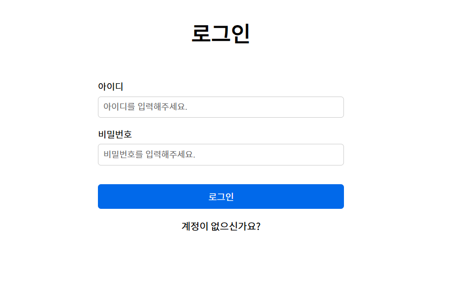
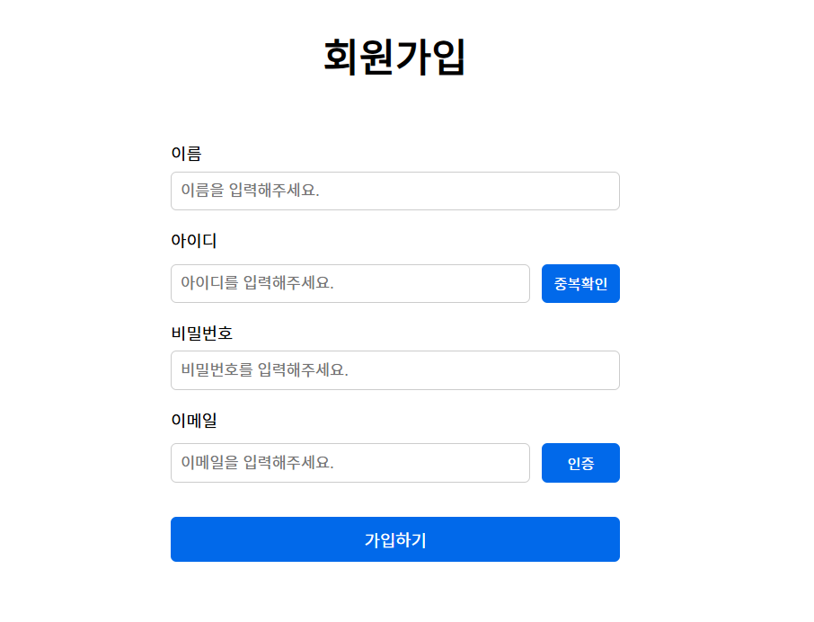
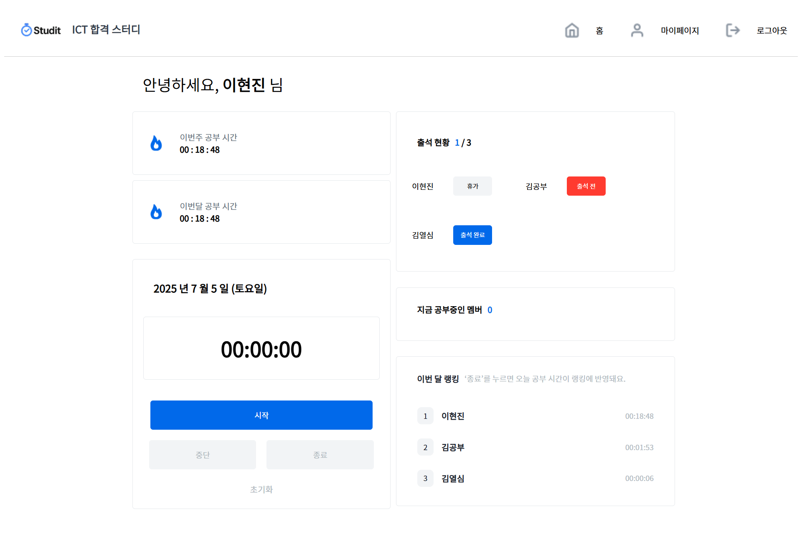
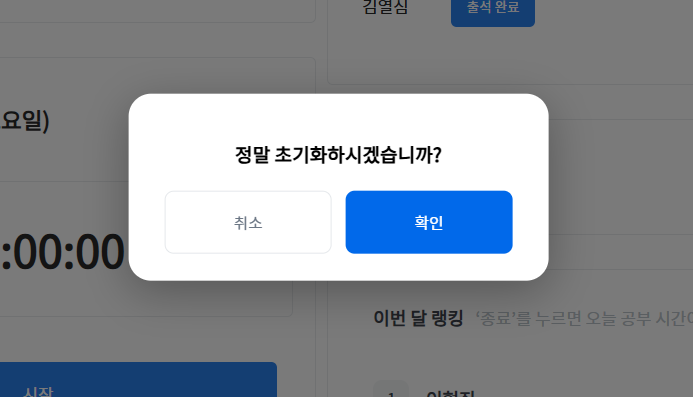
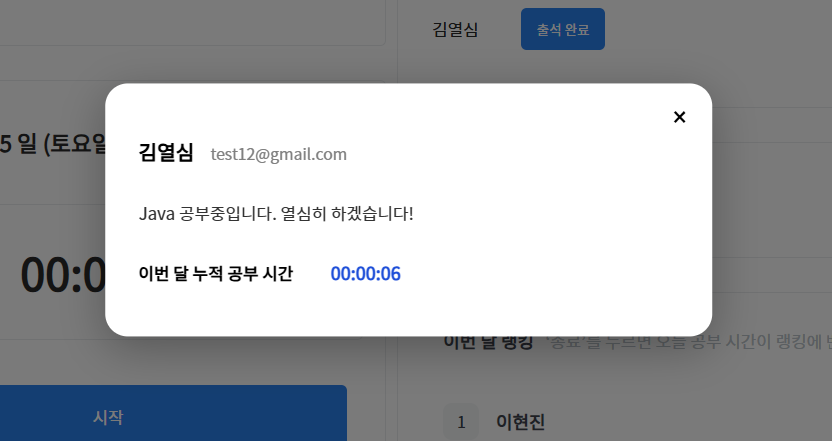
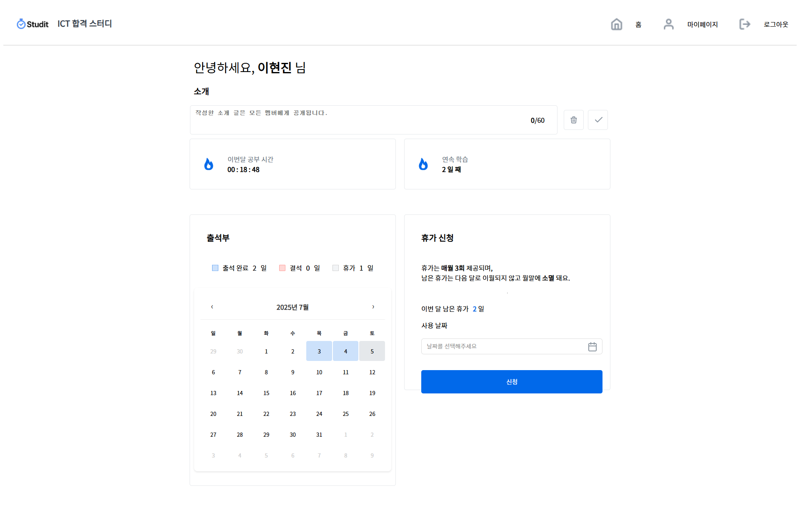
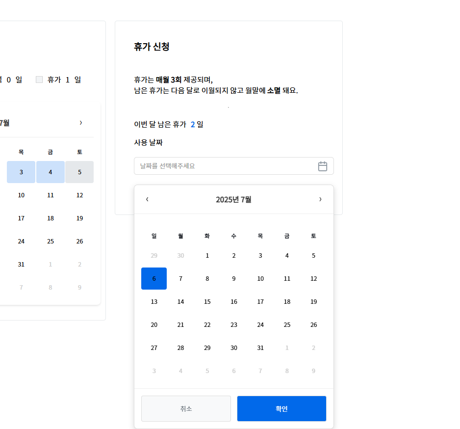
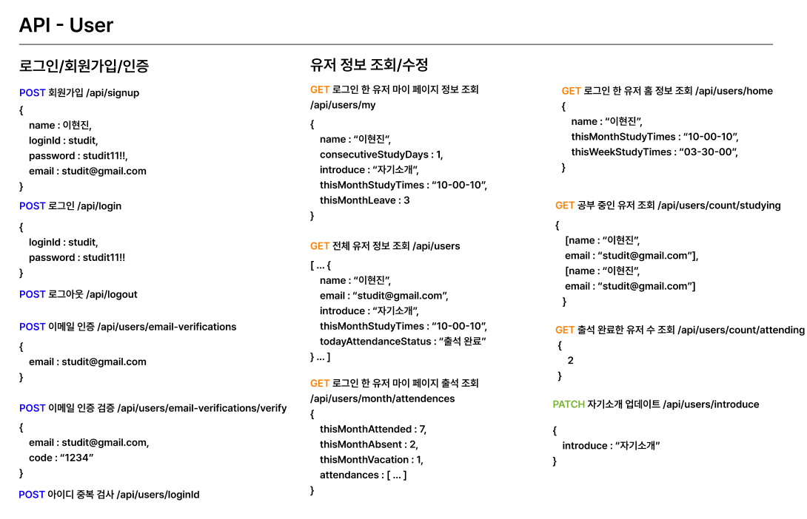
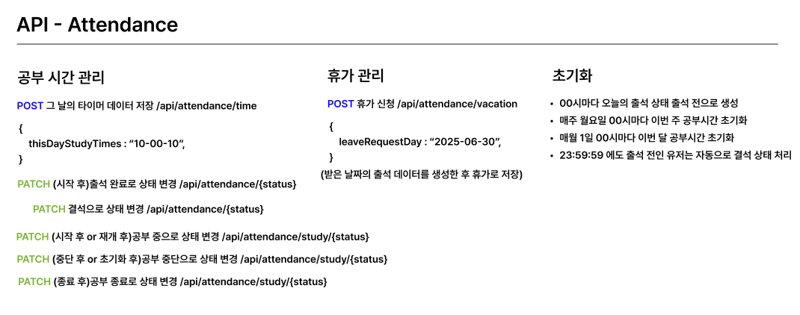
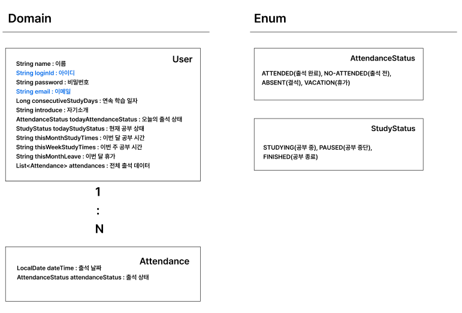

### 스터디 출석 관리 웹사이트

**웹사이트 접속 링크**
- http://43.200.176.218:8080/login.html
- 로그인 시 Id: studit, PW: studit11!!
- 회원가입도 가능

### 주제 설명
- 같이 스터디를 하는 스터디원들의 출석과 공부 시간을 효율적으로 관리할 수 있도록 설계된 웹사이트입니다.
- 공부 습관을 만들고 랭킹 시스템을 통해 팀원 간 경쟁심을 유발해 학습 지속성을 높이는 것을 목표로 합니다.

### 기여도
- 개인 100%

### 사용 기술
- **기획 디자인:** figma <br>
- **프론트엔드:** html, css, javaScript <br>
- **백엔드:** java 17, SpringBoot <br>
- **데이터베이스:** MySQL + AWS RDS <br>
- **배포:** GithubActions + AWS EC2 <br>

### 화면 및 기능 설명

**로그인/회원가입 화면** <br>


- Spring Security를 이용한 쿠키 기반 로그인을 구현했습니다.
- 회원가입 시 아이디 중복확인과 이메일 인증이 필수입니다.


**메인 홈 화면** <br>


**⏱️ 타이머로 공부 시간 기록** <br>
- 사용자는 타이머 기능으로 실시간 공부 시간을 기록할 수 있습니다.
- 상황에 따라 중단, 재개, 초기화가 가능합니다.
- 시간 초기화 시 더블 체크가 가능하도록 모달창이 등장합니다.



**스터디원 정보 확인** <br>

- 모든 곳에서 스터디원 이름을 누르면 스터디원의 이메일, 간단한 자기소개와 한달 공부 시간을 확인할 수 있습니다.

**✅ 출석 현황 시각화** <br>
- 출석 완료, 출석 전, 휴가 여부 등 멤버의 출석 상태를 한눈에 확인할 수 있어 관리가 용이합니다.

**👀 공부 중인 멤버 실시간 확인** <br>
- 현재 공부 중인 멤버를 대시보드에서 확인할 수 있습니다.

**🏆 랭킹 시스템 제공** <br>
- 한달 누적 시간 기반 랭킹을 통해 경쟁을 유도하고 학습 동기를 향상시킵니다.

**로그아웃** <br>
- 로그아웃 시 쿠키에 저장된 세션 값이 사라지며 로그인 페이지로 이동합니다.

**마이페이지 화면** <br>


**자기 소개 수정** <br>
- 스터디원들에게 보여질 자기소개를 수정하거나 삭제할 수 있습니다.

**연속 학습 시간** <br>
- 연속으로 출석 완료한 날짜를 체크하여 동기부여를 합니다.

**개인 출석부** <br>
- 달 별로 출석한 날짜와 결석한 날짜, 휴가를 쓴 날짜를 시각적으로 보여줍니다.

**휴가 신청** <br>
- 공부를 꾸준히 하기 위해선 정기적인 휴가가 필수입니다.
- 한 달에 매 3회씩 휴가가 제공됩니다.



### API




### 데이터베이스



### 프로젝트 구조도

```
+---java
|   \---com
|       \---study
|           \---studymanagement
|               +---domain
|               |   +---attendance
|               |   |   \---entity
|               |   |       +---controller
|               |   |       +---dto
|               |   |       +---repository
|               |   |       \---service
|               |   \---user
|               |       +---controller
|               |       +---dto
|               |       +---entity
|               |       +---repository
|               |       \---service
|               \---global
|                   +---common
|                   +---converter
|                   +---exception
|                   |   +---exception
|                   |   \---handler
|                   \---security
|                       \---config
\---resources
+---static
|   +---css
|   +---img
|   \---js
\---templates
```


